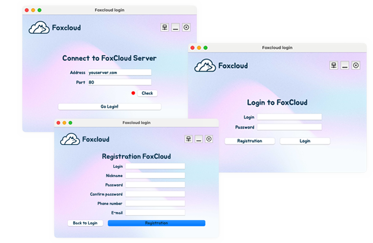
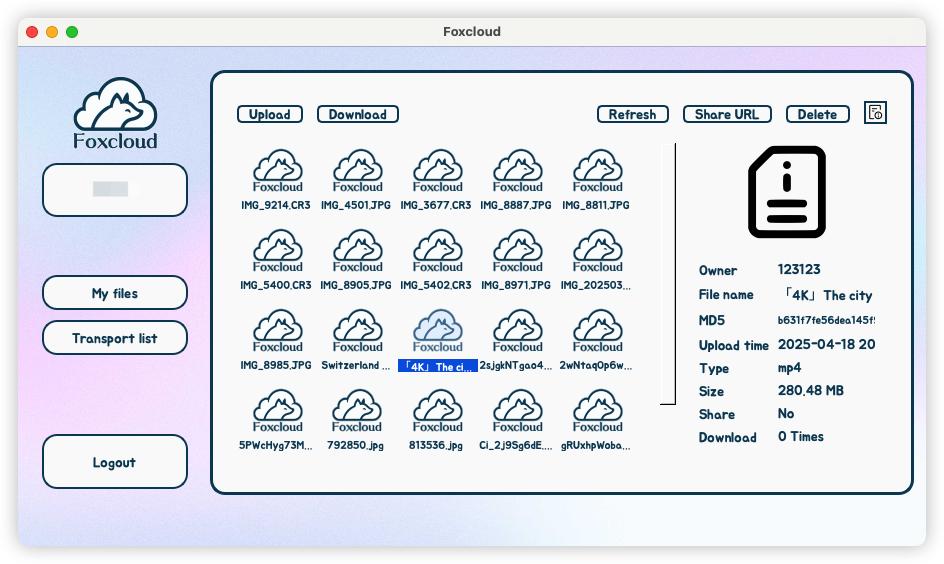

<div align="center">
<p>
 
 <p align="center"><b>High-Load Distributed Storage Solution</b></p>
</p>


[](LICENSE)


<div align="left">

<p align="center">
    <a href="./doc/README_CN.md">简体中文</a>
</p>
<!-- 顶部至此截止 -->


[toc]

# Client

Save your data to your own server!



User File List



# Server Installation

## Install via Docker

1. Install and start Docker.

2. Clone and enter the repository:

    ```bash
    git clone git@github.com:NekoSilverFox/foxcloud.git
    cd ./foxcloud/server
    ```

3. Configure database and SSH password in the `Dockerfile`:

    ```dockerfile
    ENV SSH_ROOT_PASSWORD=your_ssh_password
    ENV DB_USERNAME=your_db_username
    ```

4. Build the Docker image:

    ```bash
    docker buildx build --no-cache -t foxclouldserver .
    ```

5. Start the container (node). Optional configurations include:

| Config Key       | Description                                                  |
|------------------|--------------------------------------------------------------|
| `SSH_PORT`       | SSH port mapping (if needed)                                 |
| `TRACKER_PORT`   | Port for FDFS Tracker (default internal port: 22122)         |
| `STORGE_PORT`    | Port for FDFS Storage (default internal port: 23000)         |
| `POSTGRESQL_PORT`| Port for PostgreSQL (default internal port: 5432)            |
| `CONTAINER_NAME` | Custom container name                                        |

Examples:

- Start a Tracker node:

    ```bash
    docker run -id -p SSH_PORT:22 -p TRACKER_PORT:22122 --name TRACKER_CONTAINER_NAME foxclouldserver
    ```

- Start a Storage node:

    ```bash
    docker run -id -p SSH_PORT:22 -p STORGE_PORT:23000 --name STORGE_CONTAINER_NAME foxclouldserver
    ```

- Start all services on the same host:

    ```bash
    docker run -id -p SSH_PORT:22 -p TRACKER_PORT:22122 -p STORGE_PORT:23000 -p MYSQL_PORT:3306 -p REDIS_PORT:6379 -p NGINX_PORT:80 --name CONTAINER_NAME foxclouldserver
    ```

6. Enter the container via SSH or locally and configure FDFS.

---


## FDFS Configuration

All FDFS config files are located in `/etc/fdfs`.

### tracker.conf

| Line | Config          | Description                                              |
|------|------------------|----------------------------------------------------------|
| 17   | `bind_addr =`   | IP address of the tracker (not 127.0.0.1 or localhost)   |
| 20   | `port =`        | Port used by tracker (default: 22122)                    |
| 45   | `base_path =`   | Path to store tracker data and logs (must exist)         |

### storage.conf

| Line | Config                 | Description                                            |
|------|------------------------|--------------------------------------------------------|
| 11   | `group_name =`         | Group name for this storage node                      |
| 25   | `bind_addr =`          | Host IP (not 127.0.0.1 or localhost)                  |
| 32   | `port =`               | Port used by storage (default: 23000)                 |
| 79   | `base_path =`          | Path to store storage data and logs (must exist)      |
| 149  | `store_path_count =`   | Number of storage paths                               |
| 159  | `store_path* =`        | Actual storage paths                                  |
| 181  | `tracker_server =`     | IP and port of tracker                                |

Restart the container or use:

```bash
fdfs_trackerd /etc/fdfs/tracker.conf restart
fdfs_storaged /etc/fdfs/storage.conf restart
```

### client.conf

| Line | Config                | Description                                        |
|------|------------------------|----------------------------------------------------|
| 11   | `base_path =`         | Path for client data/logs (must exist)            |
| 26   | `tracker_server =`    | Tracker IP and port (not 127.0.0.1 or localhost)  |

### mod_fastdfs.conf

| Line | Config                 | Description                                        |
|------|------------------------|----------------------------------------------------|
|      | `base_path =`          | Must match `storage.conf` and exist               |
| 41   | `tracker_server =`     | Tracker IP and port                               |
|      | `storage_server_port =`| Port of storage server                            |
|      | `group_name =`         | Group name of storage node                        |
|      | `url_have_group_name =`| Show group in URL                                 |
|      | `store_path_count =`   | Number of storage paths                           |
|      | `store_path* =`        | Actual storage paths                              |
|      | `group_count =`        | Number of groups in system, configure each group accordingly |

### Auto Start Script Configuration

Edit the database credentials in `/root/foxcloudservers/foxcloud/server/config/cfg.json`:

```json
"mysql": {
  "user": "your_db_username",
  "password": "your_db_password"
}
```

Then restart the service with:

```bash
/root/foxcloudservers/foxcloud/server/start.sh
```

---


# Verification

| Command                                            | Description                                                |
|----------------------------------------------------|------------------------------------------------------------|
| `fdfs_test`                                        | Test FDFS installation                                     |
| `ps aux | grep fdfs*`                              | Check if FDFS services are running                         |
| `fdfs_monitor /etc/fdfs/client.conf`               | Monitor FDFS status (`ACTIVE` is healthy)                  |
| `fdfs_upload_file /etc/fdfs/client.conf FILE`      | Upload a file via client                                   |
| `fdfs_download_file /etc/fdfs/client.conf FILE_ID` | Download file                                              |
| `pg_isready`                                       | PostgreSQL health check                                    |
| `mysqladmin -uroot -p status`                      | Check MySQL installation                                   |


